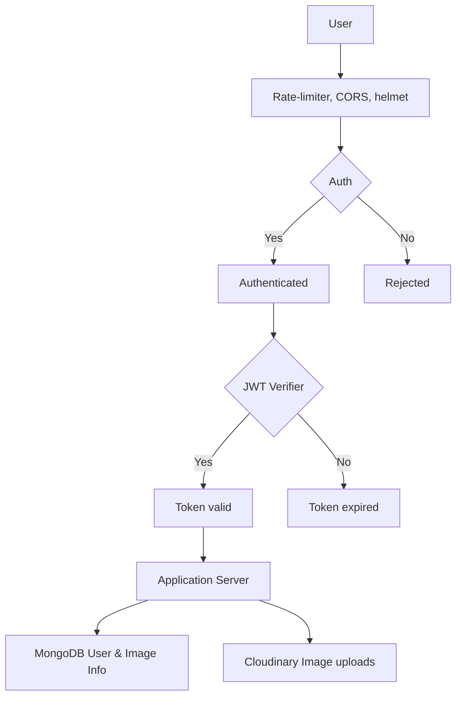
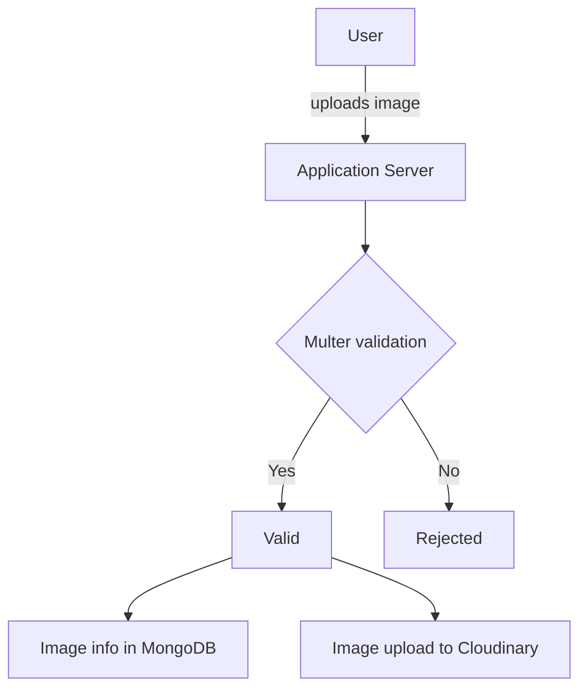

# Image Meta Data Filter: 

- This application helps users to filter their images based on their meta data. 
- this is achieved by extracting meta data of an uploaded image using exif parser.

## Installation : 

- make sure to have node.js 
- clone the repo 
- run  `npm install`
- set .env file with necessary Environment Variables.
- start the server `npm run start`

## Dependencies and it's purpose: 

- express -> web framework
- mongoose -> Database 
- jsonwebtoken -> Authorization 
- bcryptjs -> to hash passwords 
- dotenv -> to load variables from .env file  
- multer -> handling file uploads
- exif-parser -> extracting EXIF metadata from uploaded images
- cors -> rejecting random sites from calling API 
- express-rate-limiter -> rate limiter 
- helmet -> security headers.
---
- nodemon -> auto restarts server when you save changes ( dev dependency )

[Render](https://image-meta-data-filter.onrender.com/api/v1)

Links for use in Postman 

[Register](https://image-meta-data-filter.onrender.com/api/v1/auth/register)  'Post method' 
[Login](https://image-meta-data-filter.onrender.com/api/v1/auth/login)        'post method'
[Upload image](https://image-meta-data-filter.onrender.com/api/v1/images)     'post method'
[Get image](https://image-meta-data-filter.onrender.com/api/v1/images)        'Get method'
[Update data](https://image-meta-data-filter.onrender.com/api/v1/images/:id)  'Patch method'
[Delete image](https://image-meta-data-filter.onrender.com/api/v1/images/:id)  'Delete method'   

Overall Flow

Image upload flow 

